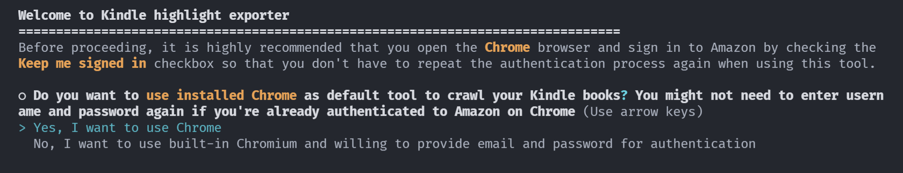
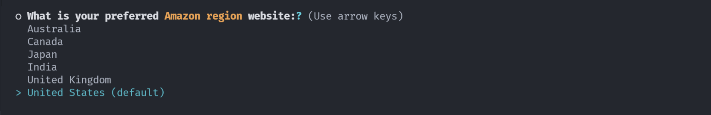
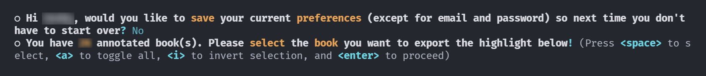
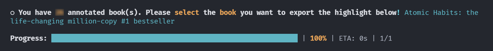

# Kindle Highliht Exporter
Simple tool to export highlights from Amazon Kindle annotated books

## About The Project
While reading a book, sometimes I come across some new words or phrases that I still don't understand the meaning of. And as a person who always wants to be better, sometimes I found nice quotes, mantra or wisdoms that relate to my life. Using Amazon Kindle, we can highlight those words, phrases, sentences or even paragraphs and then export them. We can also recall those new words or phrases using built-in flashcard feature.

The problem is, the defaut export feature can only be done in the Amazon Kindle desktop application and the number of highlights that can be exported is limited by quota set by the author. Moreover, I've already accustomed to use Notion and Remnote as my knowledge base. That's why I need an app that can export the highlights automatically, so that I can import them later into Notion or Remnote using an upcoming tool. This application is just the first step towards a bigger and more integrated app.

## Screenshots









### Built With
* [TypeScript](https://www.typescriptlang.org/)
* [Puppeteer](https://pptr.dev/)
* [Jsdom](https://github.com/jsdom/jsdom)
* [Inquirer.js](https://github.com/SBoudrias/Inquirer.js)

## Getting Started
### Prerequisites
1. Your Amazon username and password to access [Kindle Cloud Reader](https://read.amazon.com/). You might not need them as long as you're already signed in to Amazon on Chrome.
2. You need to install [Node.js](https://nodejs.org/) runtime and [Git](https://git-scm.com/) on your machine.

### Installation
1. Open the terminal
2. Clone the repo
   ```sh
   git clone https://github.com/deddyss/kindle-highlight-exporter.git
   ```
3. Go to project directory
   ```sh
   cd kindle-highlight-exporter
   ```
4. Install NPM packages
   ```sh
   npm install
   ```

## Usage
Use following command to start the app
```sh
npm run start
```

## License
Distributed under the MIT License. See `LICENSE` for more information.

## Acknowledgements
* [Jest](https://jestjs.io/)
* [Mustache.js](https://mustache.github.io/)
* [CLI-Progress](https://github.com/npkgz/cli-progress)
* [Chalk](https://github.com/chalk/chalk)
* [Ora](https://github.com/sindresorhus/ora)
* [App-root-path](https://github.com/inxilpro/node-app-root-path)
* [Pino](https://getpino.io/)
